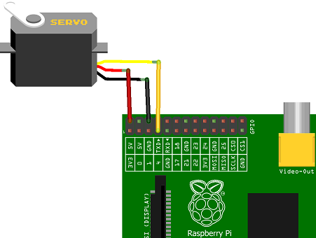
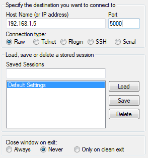

# rpi_gpio_service
Simple Raspberry Pi GPIO control service written in C++

The aim of this project is to bring up simple service on Raspberry Pi device, which would allow controlling GPIO ports by calling proper net interfaces. The included simple service allows control of PWM's pulse width on GPIO4 pin and may be easly changed allowing other features.

Simply plug servo to Raspberry Pi's GPIO4, as shown below:



Then start service with "sudo ./gpio_service" command in terminal on Raspberry Pi, and finaly connect to service from Your PC eg. with [PuTTY](https://www.putty.org/) (port 5000 is used by default):



Servo controll will be possible by typing either "1" or "0" in PuTTY's terminal.

Features:
* works directly on peripherals, no additional drivers needed
* possible multiple PWM support (multiple servos control), PWM on any available GPIO pin
* possible input and output control
* possible Pull-Up and Pull-Down resistors control

To build and run service on Raspberry Pi clone this repository and use "make" command, eg.:
```
git clone https://github.com/markondej/rpi_gpio_service
cd rpi_gpio_service
make
sudo ./gpio_service
```
